# Adhkaar

A free, open-source Android app that brings your morning and evening adhkaar to you at the right time, like an alarm clock. If you want it to, it keeps other apps covered until you've said them.

No account, no ads, no tracking. It works offline.

> **Status: preparing for the first public release.** The app builds, the tests pass and it runs on real phones, but it hasn't had wide testing yet. Reports from your phone are the most useful help right now (see [Contributing](CONTRIBUTING.md)).

## Screenshots

Screenshots are rendered from the code by the screenshot tests; every screen is in [docs/screenshots](docs/screenshots).

| | | |
|---|---|---|
| 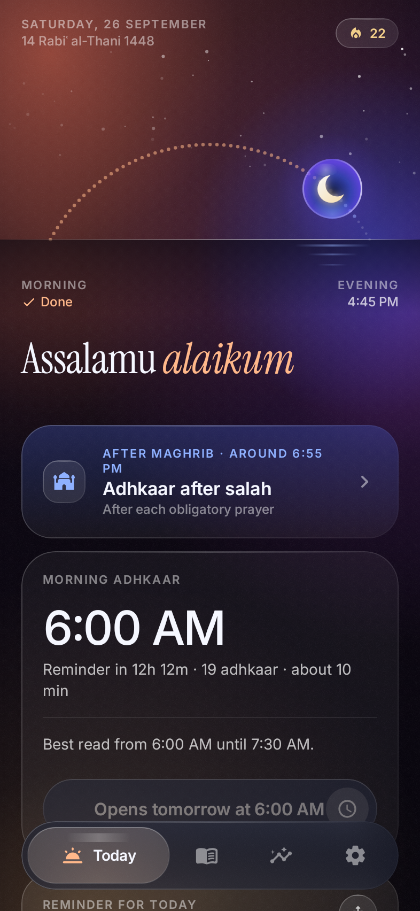 | 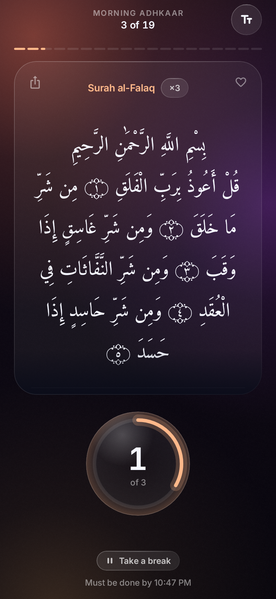 | 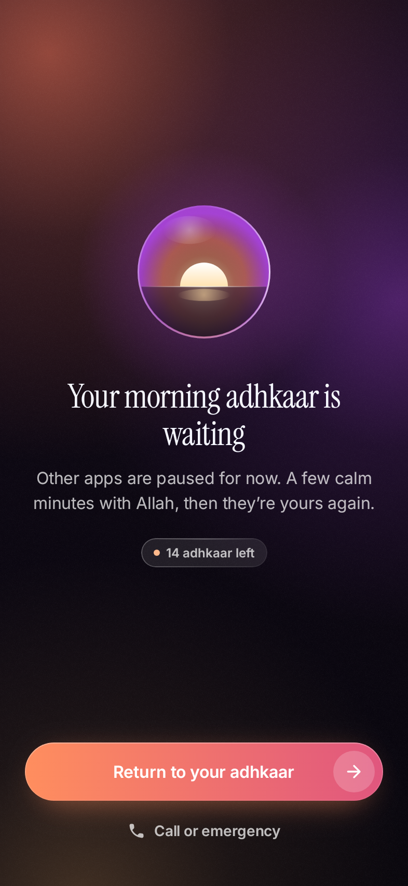 |
| Today | Session | Lockdown |
| 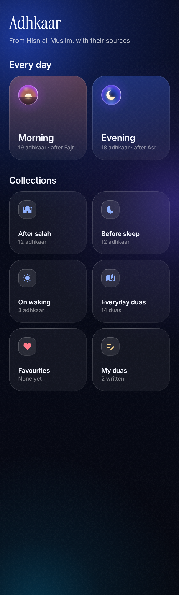 | 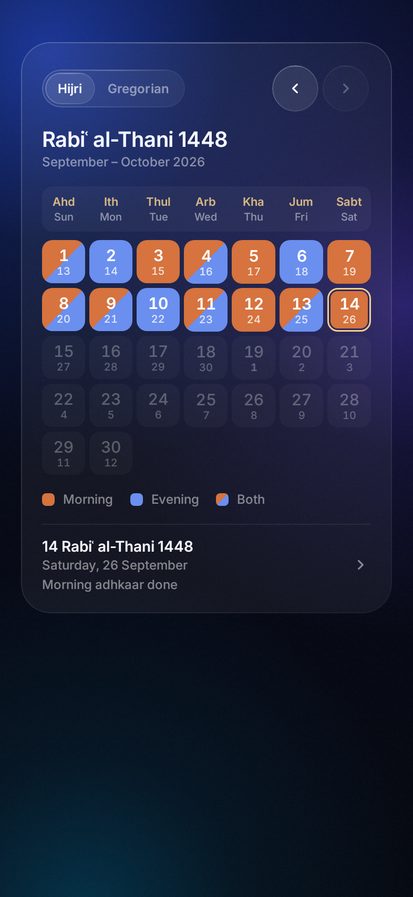 | 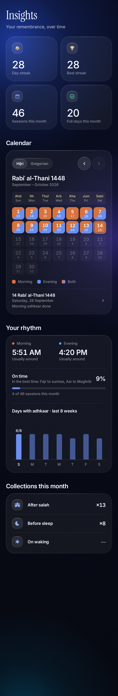 |
| Library | Calendar | Insights |
| 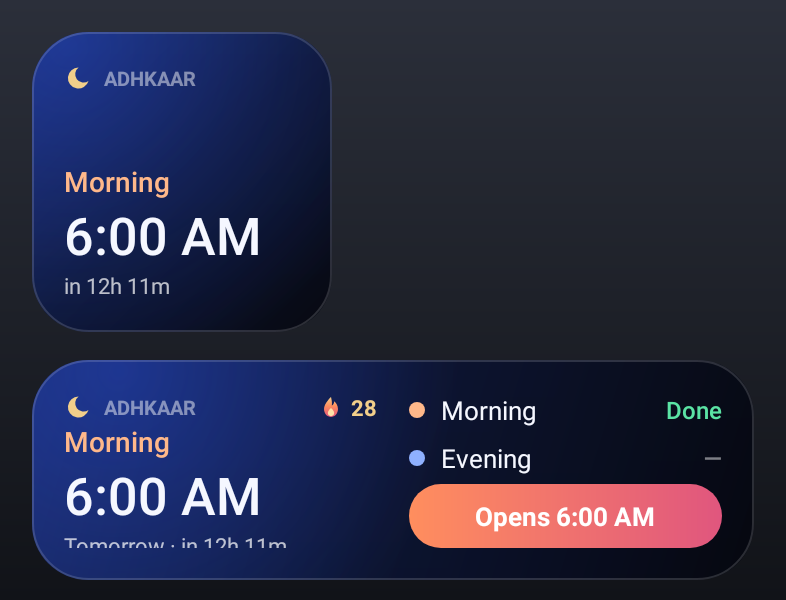 | 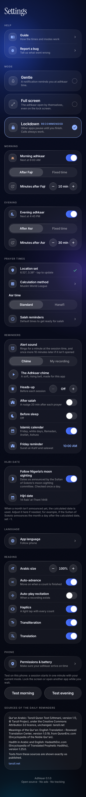 | 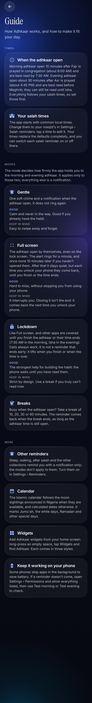 |
| Widgets | Settings | Guide |
| 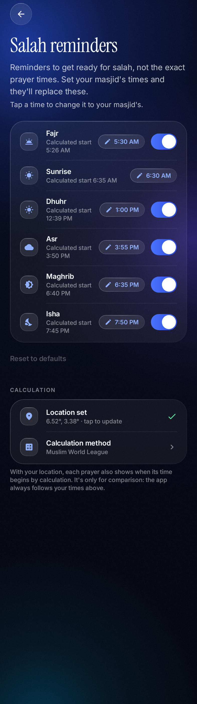 | 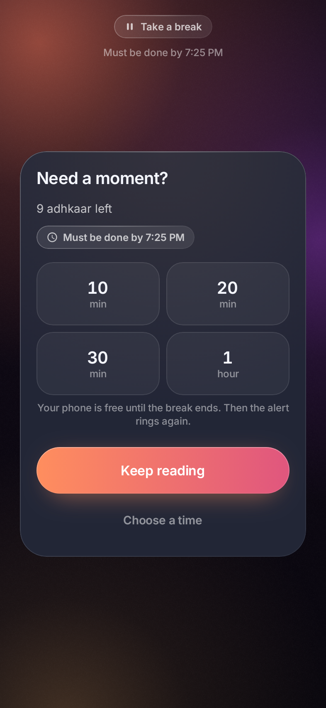 | 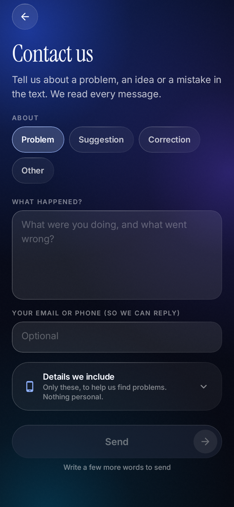 |
| Salah reminders | Breaks | Contact us |
| 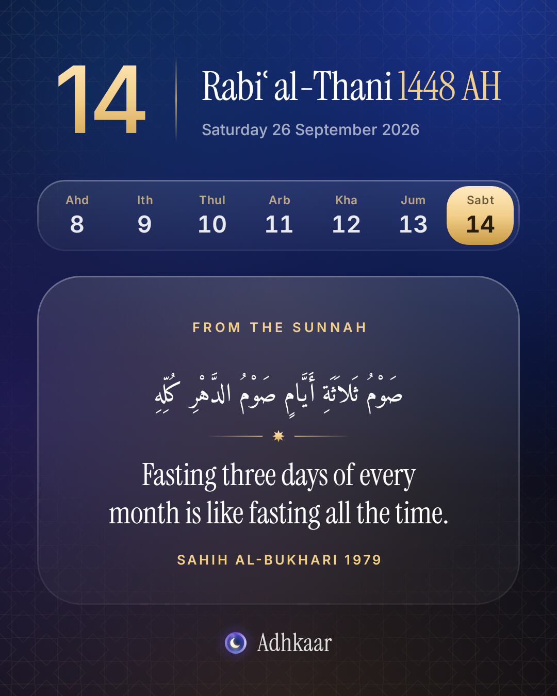 | 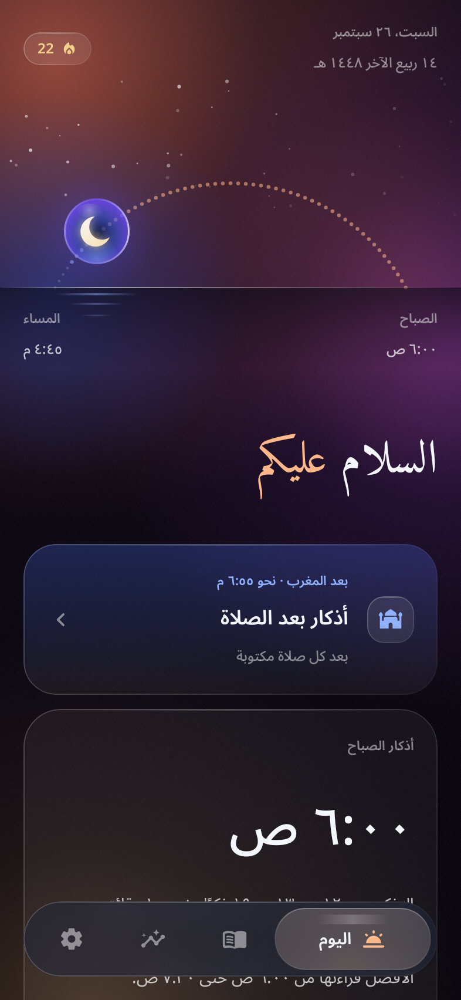 | 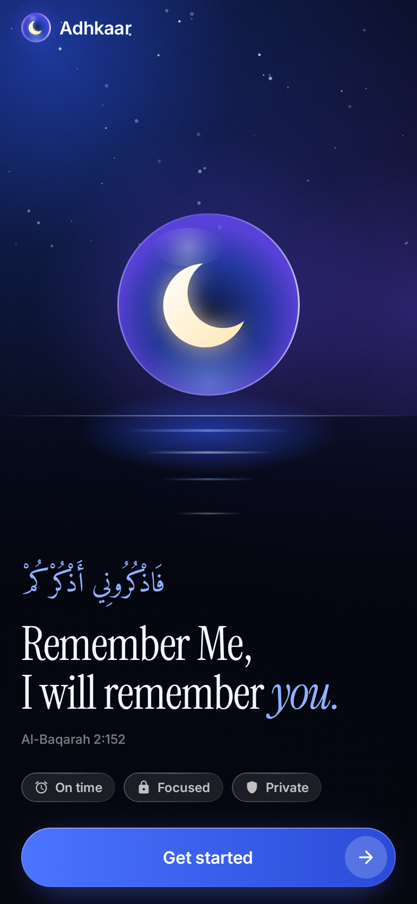 |
| Day card | Arabic | Welcome |

## What it does

### On time, every day

Times come from your own masjid, not a calculation. The app starts with common local times (Fajr 5:30, Sunrise 6:30, Dhuhr 1:00, Asr 3:55, Maghrib 6:35, Isha 7:50), and you replace them with your masjid's. Congregation is taken as 20 minutes after each time.

- **Morning adhkaar** open 10 minutes after Fajr congregation (6:00 with the defaults) and end at 7:30.
- **Evening adhkaar** open 30 minutes after Asr congregation (about 4:45), are best before Maghrib, and close at Isha.
- **After salah** adhkaar get a 15-minute reminder after each prayer.

### Three modes for morning and evening

| Mode | What happens |
|---|---|
| **Gentle** | One chime and a notification. It never rings again. |
| **Full screen** | The session opens over the lock screen, like an alarm, and rings again until you're done. |
| **Lockdown** | Full screen, and other apps are covered until the adhkaar are finished or their time ends (7:30 in the morning, Isha in the evening). |

Busy? Take a break of 10, 20, 30 or 60 minutes instead of skipping, as long as it ends before the adhkaar time does. Calls, the dialer, SMS and emergency calls are never blocked.

Other collections (before sleep, on waking, after salah and more) and salah reminders are plain notifications at your times.

### Everything else

- **Focused reading.** One dhikr at a time: Arabic, transliteration, meaning and source, with a tap counter and haptics.
- **Collections and your own duas.** Write your own duas, add them to a session, and record them in your own voice.
- **Hijri and Gregorian calendar.** Hijri dates follow Nigeria's moon sighting as declared by the Sultan of Sokoto (NSCIA), updated automatically. See [docs/MOON_SIGHTING.md](docs/MOON_SIGHTING.md).
- **A reminder for each day.** 1,231 Qur'an verses and sahih hadith from Tanzil, QuranEnc and HadeethEnc, shown exactly as published and credited in Settings. See [docs/REMINDERS.md](docs/REMINDERS.md).
- **Widgets.** 7 home-screen widgets, each in 3 styles.
- **Insights.** Streaks, a month calendar, your usual times and weekday consistency.
- **Share cards.** Share a dhikr or the day's reminder as an image.
- **6 languages.** English, Arabic, Urdu, Hausa, Yoruba and Igbo, with right-to-left layout for Arabic and Urdu.
- **Private.** The only network request is a download of the public moon-sighting file from this repository. Nothing is ever sent. An optional location, if you give one, stays on the phone and is only used to show calculated times next to yours for comparison.

## Install

- **Google Play:** coming soon.
- **APK:** download from [Releases](../../releases) once 1.0 is out. Until then, each CI run on `main` uploads a debug APK as a build artifact.

Android 8.0 (API 26) or newer. For Full screen and Lockdown, the in-app guide walks you through the permissions your phone needs, including the brand-specific battery settings on Xiaomi/HyperOS, Oppo, Vivo, Samsung, Tecno/Infinix and others.

## Build

You need JDK 17 and the Android SDK (platform 36).

```bash
./gradlew assembleDebug                    # APK in app/build/outputs/apk/debug/
./gradlew installDebug                     # install on a connected phone
./gradlew testDebugUnitTest                # unit tests + screenshot rendering
./gradlew testDebugUnitTest -PnoScreens    # logic tests only, in seconds
./gradlew lintDebug
```

Screens are rendered on the JVM with Robolectric and Roborazzi, so you can review UI changes without an emulator. Running the tests writes the images into `docs/screenshots/`.

Stack: Kotlin 2.1 and Jetpack Compose, Glance for widgets, R8 and a Baseline Profile for release builds. [docs/WHY_KOTLIN.md](docs/WHY_KOTLIN.md) explains why it's native, and [PLAN.md](PLAN.md) describes the architecture.

## Contribute

The most useful things right now:

1. **Test on your phone** and report how it behaves on your brand and Android version.
2. **Review content:** Arabic, translations, references, and the Hausa, Yoruba and Igbo interface text.
3. **Code:** fixes and features that fit the plan.

Start with [CONTRIBUTING.md](CONTRIBUTING.md). Content changes follow a stricter review, described in [GOVERNANCE.md](GOVERNANCE.md). Please read the [Code of Conduct](CODE_OF_CONDUCT.md), and report security issues as described in [SECURITY.md](SECURITY.md).

## Licence

Adhkaar is free to use, study, change and share, but **not for commercial purposes**.

- **Code:** [PolyForm Noncommercial 1.0.0](LICENSE). Selling the app or its code, or using it in a paid product, needs written permission.
- **Our own content and design:** [CC BY-NC-SA 4.0](LICENSE-CONTENT.md).

Because commercial use is restricted, this is *source-available* rather than open source in the OSI sense.

Bundled third-party content keeps its own terms: the fonts (Amiri Quran, Aref Ruqaa, Inter, Instrument Serif) are under the SIL Open Font License ([docs/FONTS-OFL.txt](docs/FONTS-OFL.txt)), and the daily reminders follow the terms of their sources ([docs/REMINDERS.md](docs/REMINDERS.md)).

## Credits

- **Adhkaar:** *Hisn al-Muslim* (Fortress of the Muslim), with the hadith reference on each dhikr.
- **Qur'an text:** [Tanzil Project](https://tanzil.net), Uthmani text, CC BY 3.0, unchanged.
- **Qur'an meanings:** Rowwad Translation Center, via [QuranEnc.com](https://quranenc.com).
- **Hadith:** [HadeethEnc.com](https://hadeethenc.com), Arabic and English.
- **Hijri dates:** National Moonsighting Committee and NSCIA declarations, as reported publicly.
- **Libraries:** Jetpack Compose, Glance, [Haze](https://github.com/chrisbanes/haze), [adhan-java](https://github.com/batoulapps/adhan-java), Robolectric, Roborazzi.
- **Design system:** [docs/design/DESIGN.md](docs/design/DESIGN.md).
